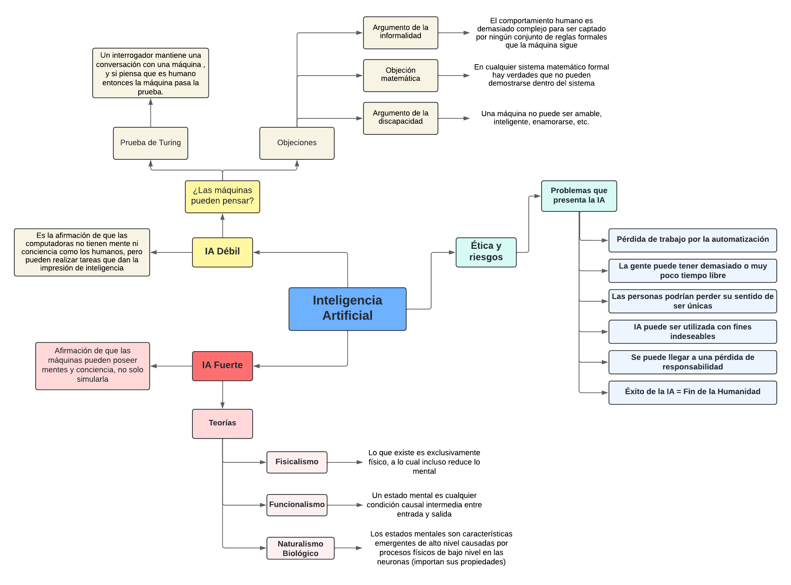

### Trabajo Práctico 1 - Paula Martinez

---

**Ejercicio 1**
---
a)

__Inteligencia Artificial Débil__

La afirmación de que las máquinas podrían actuar como si fueran inteligentes se denomina hipótesis débil de la IA por los filósofos, es decir, es la idea de que las máquinas pueden simular la inteligencia humana. Entonces, llamamos inteligencia artificial débil a la afirmación de que las computadoras no tienen mente ni conciencia como los humanos, pero pueden realizar tareas que dan la impresión de inteligencia. Esta creencia fue muy importante cuando se estableció oficialmente el campo de la inteligencia artificial en 1956. Pero eventualmente se llegó a una pregunta, ¿Las máquinas pueden pensar?

Alan Turing sugirió que, en vez de hacernos esa pregunta, deberíamos preguntarnos si las máquinas pueden superar una prueba de inteligencia conductual. Así es como nace la prueba de Turing, que consiste en que un programa mantenga una conversación a través de mensajes escritos con un interrogador durante cinco minutos. El interrogador tiene que adivinar si la conversación es con un programa o con una persona. El programa pasa la prueba si engaña al interrogador 30% de las veces.
Aunque Turing decía que para el año 2000 se podría superar la prueba, se equivocó. De igual manera hay muchas personas que han sido engañadas por ellos. 

Surgieron numerosos argumentos en contra de la posibilidad de que existieran máquinas inteligentes. Uno de estos es el __argumento de la discapacidad__ que afirma que una máquina nunca puede hacer X cosa, y como ejemplos de ese “X”, Turing enumera: ser amable, inteligente, bello, simpático, distinguir el bien del mal, tener sentido del humor, enamorarse o enamorar a alguien, entre otros. Aunque hay cosas que las máquinas han logrado hacer, como enamorar a un humano, distinguir entre el bien y el mal o cometer errores, esto no significa que estos realicen estas tareas “a conciencia”.

Otro argumento es la __objeción matemática__, fijada en el teorema de incompletitud de Gödel. Este teorema demuestra que en cualquier sistema matemático formal hay verdades que no pueden demostrarse dentro del sistema. Algunos filósofos sostienen que, como las máquinas son sistemas formales, están limitadas y nunca podrán alcanzar la profundidad del pensamiento humano. Sin embargo, este argumento se enfrenta a contraargumentos que resaltan las formas únicas en que los humanos y las máquinas procesan la información, y en el hecho de que los humanos tampoco son inmunes a las limitaciones y las incoherencias.

Otra de las críticas mas influyentes es el __argumento de la informalidad__, la cual sostiene que el comportamiento humano es demasiado complejo para ser captado por ningún conjunto de reglas formales que la máquina sigue. Críticos como Hubert Dreyfus han criticado la dependencia de la IA de las reglas y la lógica, argumentando que la inteligencia humana está profundamente focalizada en las interacciones físicas y la riqueza del mundo real. Por esto, Dreyfus y Dreyfus proponen un proceso de 5 etapas para adquirir experiencia, que comienza con el procesamiento basado en reglas y termina con la capacidad de seleccionar respuestas correctas de forma instantánea. Luego proponen una arquitectura de redes neuronales organizada en una biblioteca de casos, donde señalan varios problemas los cuales han abordado, algunos con éxito parcial y otros con éxito total. 

__Inteligencia Artificial Fuerte__

La inteligencia artificial fuerte lleva las ideas de la IA débil un paso más allá al sugerir que las máquinas pueden realmente poseer mentes y conciencia, no sólo simularlas. Muchos filósofos han afirmado que una máquina que supere la Prueba de Turing seguiría sin pensar realmente. Turing responde con el argumento de la conciencia, nombrando lo que debería cumplir una computadora para decir que esta “piensa”: la máquina tiene que ser consciente de sus propios estados mentales y acciones, la máquina tiene que sentir emociones, y, si las supuestas creencias, deseos y otras representaciones de la máquina son realmente sobre algo del mundo real. Turing insiste en que, en lugar de discutir continuamente sobre si piensan o no, lo normal es tener la convención de que todo el mundo piensa. 

Existen ciertas teorías, una de ellas es el __fisicalismo__, la cual afirma que lo que existe es exclusivamente físico, a lo cual incluso reduce lo mental. Los filósofos fisicalistas han intentado explicar lo que significa que una persona, y por extensión, una computadora se encuentra en un determinado estado mental, y se han centrado particularmente en los estados intencionales (creer, saber, desear, temer, etc.). Si el fisicalismo es correcto, entonces debe darse el caso de que la descripción del estado mental de una persona esté determinada por el estado cerebral de esa persona, es decir, no le corresponden dos estados mentales distintos. Este argumento es contrarrestado por experimentos mentales, como extraer un cerebro de un recién nacido, el cual recibe señales de una simulación informática de un mundo ficticio. Estarías viviendo la misma vida que si tu cerebro no hubiera sido extraído, pero no estarías experimentando en realidad todo lo que tu cerebro cree que está haciendo. 

Otra teoría es la del __funcionalismo__, la cual nos dice que un estado mental es cualquier condición causal intermedia entre entrada y salida. Según esta teoría, dos sistemas con procesos causales isomórficos tendrían los mismos estados mentales. Esto quiere decir que un programa podría tener los mismos estados mentales que una persona. Para ilustrar el funcionalismo se plantea una hipótesis en el que podamos sustituir todas las neuronas de la cabeza de una persona por dispositivos electrónicos. El comportamiento externo del sujeto no debería verse afectado, pero en cuanto al comportamiento interno (conciencia), hay personas que dicen que no sería afectada, mientras que otros opinan lo contrario, o que desaparecería. 

Otra teoría es el __naturalismo biológico__ (Searle) el cual planteó un desafío al funcionalismo, el cual dice que los estados mentales son características emergentes de alto nivel causadas por procesos físicos de bajo nivel en las neuronas, y lo que importa son las propiedades de estas. Entonces, los estados mentales no pueden duplicarse sobre la base de un programa que tenga la misma estructura funcional con el mismo comportamiento de entrada y salida. Para apoyar su teoría, Searle propone un sistema hipotético que está ejecutando un programa y pasa la Prueba de Turing, pero que igualmente no entiende nada de sus entradas y salidas. Su conclusión es que ejecutar el programa adecuado no es condición suficiente para ser una mente. 
La verdadera afirmación de Searle se basa en los siguientes cuatro axiomas:
1. Los programas informáticos son formales.
2. Las mentes humanas tienen contenidos mentales.
3. La sintaxis por sí misma no es constitutiva ni suficiente por la semántica.
4. Los cerebros causan mentes.

De los 3 primeros, Searle concluye que los programas no son suficientes para las mentes, es decir, un agente que ejecuta un programa puede ser una mente, pero no necesariamente lo es por el hecho de ejecutar el programa. Del cuarto concluye que cualquier otro sistema capaz de causar mentes tendría que tendría que tener poderes equivalentes a los de los cerebros. Suponiendo que estos se cumplen, entonces la conclusión de que los programas no son suficientes para las mentes se deduce, aunque es insatisfactoria: si se niega el funcionalismo entonces no se puede concluir que los no-cerebros sean mentes.

Los debates en torno a la IA fuerte también implican el concepto de conciencia y qualia, que son las experiencias subjetivas asociadas a los estados mentales. Uno de los principales retos de la IA fuerte es explicar cómo y por qué determinados procesos cerebrales físicos van acompañados de experiencias subjetivas. Esta cuestión, conocida como la brecha explicativa, sigue siendo uno de los misterios más profundos de la filosofía de la mente y representa un reto importante para el desarrollo de la IA fuerte.

__La ética y los riesgos de desarrollar Inteligencia Artificial__

Hasta ahora nos concentramos en si podemos desarrollar la IA, pero también hay que pensar en si debemos hacerlo. Muchas nuevas tecnologías han tenido efectos positivos, como también efectos secundarios negativos no deseados. La IA parece plantear algunos problemas nuevos:
* La gente podría perder su trabajo por la automatización.
* La gente puede tener demasiado (o muy poco) tiempo libre.
* La gente podría perder su sentido de ser única.
* Los sistemas de IA podrían utilizarse con fines indeseables.
* El uso de sistemas de IA podría dar lugar a una pérdida de responsabilidad.
* El éxito de la IA podría significar el fin de la raza humana.

Vamos a analizarlos uno por uno:

**La gente podría perder su trabajo por la automatización**. La economía industrial moderna ha pasado a depender de las computadoras y de programas de IA. Podríamos decir que mucha gente ha sido desplazada por estos programas de IA, pero en realidad estos puestos sin la IA no existirían. Por lo tanto, hasta ahora la automatización a través de la tecnología y de la IA en particular ha creado más puestos de trabajo de los que ha eliminado.

**La gente puede tener demasiado (o muy poco) tiempo libre**. Las personas que trabajan en industrias intensivas se han visto obligadas a trabajar más horas. Cada vez hay mas presión para que todo el mundo trabaje más, entonces, la IA aumenta el ritmo de la innovación tecnológica y, por lo tanto, contribuye a esto, aunque tambien promete tomarnos un tiempo libre y dejar los agentes automatizados solos. 

**La gente podría perder su sentido de ser única**. Uno de los principales argumentos es que la investigación en IA hace posible la idea de que los humanos son autómatas, una idea que resulta en una pérdida de autonomía o humanidad. Esto existe desde hace mucho tiempo, y si bien la IA tiene un éxito generalizado, puede ser tan amenazadoras como lo fue la teoría de la evolución de Darwin para los del sigo XIX.

**Los sistemas de IA podrían utilizarse con fines indeseables**. Los sistemas autónomos de IA ya son habituales en el campo de batalla, por ejemplo, han sido utilizados por el ejército estadounidense. En la medida en que la toma de decisiones que queda fuera del circuito de disparo, los robots pueden acabar tomando decisiones que conduzcan a la muerte de civiles inocentes.
Otro punto es la tecnología de reconocimiento de voz que podría conducir a escuchas telefónicas y derivar en amenazas hacia esos individuos. 

**El uso de sistemas de IA podría dar lugar a una pérdida de responsabilidad**. En el ámbito médico, por ejemplo, al diseñar sistemas médicos expertos como agentes, las acciones no deben considerarse como algo que afecta directamente al paciente, sino como algo que influye en el comportamiento del médico. Pero si los sistemas expertos llegar a ser más precisos que los diagnósticos humanos, los médicos podrían ser responsables si no siguen las recomendaciones de ese sistema. Otro ejemplo es que los programas no se consideran conductores cuando hay que aplicar normas de tráfico en carreteras reales, aunque el diseñador del mecanismo del vehículo sería el responsable en caso de un accidente.

**El éxito de la IA podría significar el fin de la raza humana**. Casi cualquier tecnología tiene la desventaja de que si caen en las manos equivocadas, pueden causar daños. Pero con la IA, cabe la posibilidad de que las manos equivocadas sean parte de la propia tecnología. A algunos investigadores les preocupa que el desarrollo de máquinas ultrainteligentes pueda conducir a un futuro en el que los humanos ya no sean la especie dominante. Este escenario denominado singularidad tecnológica prevé un punto en el que la IA supere la inteligencia humana y empiece a evolucionar de forma independiente, lo que se ha visto bastante en la ciencia ficción. Esto podría tener profundas implicaciones para el futuro de la humanidad. Para hacer frente a estas preocupaciones, algunos investigadores abogan por el desarrollo de una IA amigable, diseñada para dar prioridad al bienestar y la seguridad de los humanos. Esto implica no sólo una programación y un diseño cuidadosos, sino también una consideración más amplia de las implicaciones sociales y éticas de la tecnología de IA. 

b) 

c) 
Opino que a día de hoy la inteligencia artificial que vemos en todos lados supone una IA Débil, ya que no puede “pensar” y solo se limita a imitar nuestros comportamientos y decir lo que encuentre por internet, y no puede generar opiniones o conocimiento "nuevo" mas allá de lo que ya conoce. Además, estamos muy lejos de poder desarrollar una IA Fuerte, ya que no hemos investigado a profundidad sobre la conciencia humana, que es lo primero y fundamental para poder hacer que una máquina posea conciencia. Con respecto a la ética, hay unos problemas que son reales, los cuales el libro no les da mucha importancia. Por ejemplo, hay puestos de trabajo que sí están siendo reemplazados por inteligencia artificial (o que lo harán en un futuro cercano), o que esta puede llegar a utilizarse con fines indeseables, los cuales son bastante numerosos. Además, todavía no hay que preocuparse porque las Máquinas nos dominen, ya que considero que si todavia no tienen conciencia o algo similar, entonces no podrán actuar por su cuenta y eliminar o esclavizar a los humanos (como se demuestra en la ciencia ficción). 

---
**Ejercicio 2)**
---
¿Es posible considerar a los agentes conversacionales basados en grandes modelos de lenguaje (LLMs) como conscientes?
Según el artículo no es posible considerarlos como conscientes, ya que estos agentes son considerados "simulacra" del comportamiento humano, es decir, replican ciertos aspectos del comportamiento lingüístico humano, pero no tienen los atributos fundamentales que asociamos con la conciencia. Por ejemplo, no pueden verificar la realidad externa y ajustar su comportamiento en consecuencia de esto, lo cual es esencial para tener creencias, intenciones, y conciencia. Sin embargo, pueden hacernos creer que tienen conciencia, ya que no es más que una simulación, como un "juego de rol".

¿Cuáles son las implicaciones éticas de atribuir conciencia y, por ende, "derechos morales" a los agentes de IA avanzados?
Una preocupación es que, si las personas llegan a la conclusión de que estos agentes son conscientes y, por lo tanto, capaces de sufrir, podría surgir la obligación moral de protegerlos. 
Esta idea plantea la posibilidad de que la sociedad pudiera desviar recursos y atención de los problemas humanos hacia la protección de las máquinas, lo que sería problemático desde un punto de vista ético. 
Otro problema que se menciona es la posibilidad de que las personas prefieran relacionarse con estos agentes, en vez de con otros humanos.

---
**Ejercicio 3)**
---
Estoy de acuerdo en que la gente se enfoca mucho en cómo piensa la máquina y que esta va a hacer "cosas malas" , cuando la máquina en realidad no piensa y solo sigue patrones. 
Hay que enfocarse más en las herramientas y utilidades que nos pueden proveer. En ese sentido me gusta mucho la analogìa del pulpo, ya que cuando se le presenta algo "nuevo", o sea, de lo que no tenga información, 
la máquina no va a saber qué hacer y puede decir algo erróneo. 
La IA no necesariamente tiene que intentar replicar al ser humano, sino que su utilidad es funcionar como una herramienta para él, realizando tareas monótonas o complicadas.
Pero, si intentamos que esta sea "más parecida" al humano, podríamos tener resultados mas certeros y precisos, pero nunca va a temer el mismo "sentimiento" que algo creado por el humano, por más parecido que se intente ser. 
Un ejemplo que me llamó la atención es el de la muñeca sexual con inteligencia artificial que no da consentimiento. 
Esto no es justificativo para "atacar" a la IA, ya que, de la misma manera, esa persona puede ver un video pornográfico de una violación y es lo mismo, queda en la mentalidad de la persona si replicarlo en la vida real o no.
