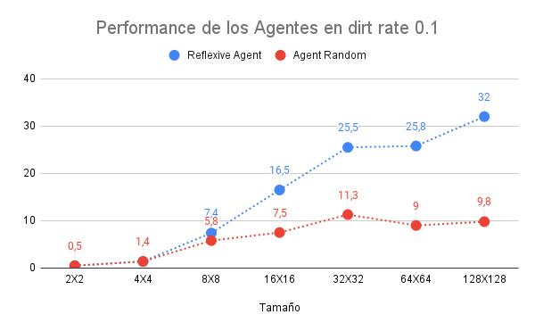
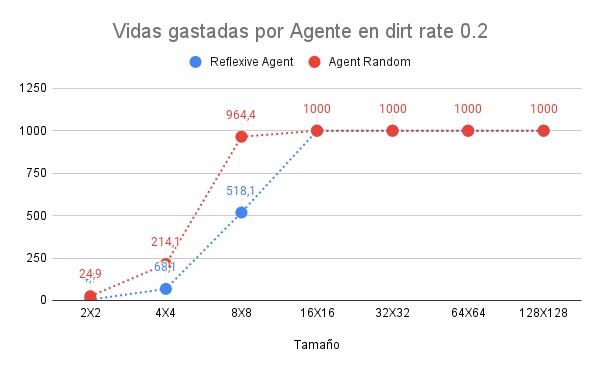
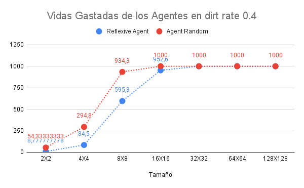

# Comparación Agente Reflexivo con Agente Random

---
## Introducción 

---
En el presente informe se realiza una comparación del rendimiento de dos distintos agentes, los cuales tienen el mismo
objetivo: limpiar celdas sucias. Para esto se realizaron simulaciones en el mismo entorno, las cuales vamos a analizar con más profundidad.

## Marco Teórico

---
### Funcionamiento del entorno

El entorno es una cuadrícula de celdas donde cada celda puede estar o sucia o limpia, y las casillas sucias se generan
de forma aleatoria (no se regeneran una vez limpiada). El entorno es configurado con diferentes tamaños y distintos
porcentajes de suciedad, lo que simula diferentes grados de dificultad para los agentes. Estos comienzan en una casilla
aleatoria del entorno.

### Agentes
Se utilizaron dos tipos de agentes: un agente reflexivo simple y un agente aleatorio.
Las reglas y especificaciones a seguir de los dos agentes son: 
- Sus acciones permitidas son: moverse arriba, abajo, izquierda, derecha, limpiar y no hacer nada. 
- Son premiados con un punto por cada celda sucia aspirada.
- Tienen una cantidad finita de vidas (1000 vidas).

### Agente reflexivo
El agente reflexivo es un tipo de agente que toma decisiones basadas en la situación actual del entorno sin tener en
cuenta estados previos ni anticipar futuros estados. En este caso, el agente observa la celda en la que se encuentra;
si está sucia, la limpia, y si está limpia, se mueve a una celda adyacente (de manera aleatoria). 

### Agente aleatorio
El agente aleatorio toma decisiones de manera completamente aleatoria. Cada vez que se enfrenta a una acción, elige
al azar entre limpiar la celda en la que se encuentra (esté sucia o no), no hacer nada o moverse a una celda adyacente.

## Diseño experimental

---
Para evaluar el rendimiento de los agentes, se realizaron simulaciones,  llevadas a cabo en Python, en entornos de
diferentes tamaños: 2x2, 4x4, 8x8, 16x16, 32x32, 64x64, y 128x128, con distintos porcentajes de suciedad (dirt rate) 
de 10%, 20%, 40% y 80%.
Cada configuración de tamaño fue probada 10 veces para ambos agentes y en el mismo entorno para los dos,
registrando el performance (cantidad de celdas sucias limpiadas) y las vidas gastadas (cantidad de movimientos o 
acciones que realizó el agente).

## Análisis y discusión de resultados

---
Los resultados de las simulaciones fueron guardados en un archivo csv (simulation_results.csv). Con estos resultados
fue posible realizar gráficos para comparar los resultados de los dos agentes. Para esto, se realizó un promedio
de las 10 pruebas por cada tamaño y se separó cada gráfico por porcentaje de suciedad,

Primero analicemos el performance (cantidad de celdas limpiadas) de los dos agentes por cada dirt rate:

Viendo los gráficos podemos observar que el agente reflexivo es significativamente mejor al agente aleatorio. Esto tiene
sentido, ya que el agente random al ser todos sus movimientos aleatorios, aunque se encuentre en una celda sucia, es 
bastante probable que no la limpie, o lo termine haciendo después. Podemos observar también que, a medida que crece el
entorno, se nota aún más la diferencia de performance entre los dos agentes, siendo la del agente reflexivo superior. 

Ahora podemos analizar las vidas gastadas de cada agente (movimientos o acciones realizadas) por cada porcentaje de 
suciedad:

Viendo estos gráficos podemos notar que no hay mucha diferencia entre los dos agentes, pero de igual manera sigue siendo
más efectivo el agente reflexivo, llegando a su objetivo (en algunas ocasiones) en menor cantidad de acciones. Podemos 
ver, además, que a medida que el entorno crece, esta diferencia entre los dos agentes se hace cada vez más pequeña.

## Conclusiones

---
El análisis de los resultados muestra que el agente reflexivo supera significativamente al agente aleatorio en términos
de rendimiento y eficiencia en la mayoría de los entornos simulados.