# Reporte de los resultados de los algoritmos en Frozen Lake

## Introducción:

En este trabajo se analizarán y compararán cuatro algoritmos de búsqueda no  informada, uno de búsqueda informada y un agente con movimientos aleatorios,  evaluando su rendimiento en términos de eficiencia y tiempo empleado por cada uno.

## Marco Teórico:

El entorno utilizado para realizar los experimentos es "Frozen Lake" de la librería Gymnasium, en el lenguaje de programación Python. Este entorno es una cuadrícula de nxn que consiste en bloques de hielo (donde puede pasar el personaje), agujeros (donde el personaje se cae si pasa por ellos) y un cofre (la meta o donde tiene que llegar el personaje). Este personaje o agente puede moverse solo en 4 direcciones: arriba(3), abajo(1), izquierda(0) y derecha(2). 
Para que el agente pueda llegar a la meta, se utilizaron los siguientes algoritmos de búsqueda:
- Búsqueda no informada:
    - **Breadth-First Search** (BFS): Recorre un grafo en altura. 
    - **Depth-First Search (DFS)**: Recorre un grafo en profundidad. 
    - **Limited Search (límite = 10)**: Consiste en un DFS pero limitado en profundidad.
    - **Uniform Cost Search(UCS)**: Recorre un grafo según el costo de cada movimiento.
- Búsqueda informada:
    - **A Estrella**: Recorre un grafo en base a una heurística definida. 

Además, se utilizó un agente el cual todos sus movimientos son aleatorios, el cual su eficacia está basada puramente en suerte. 

## Diseño Experimental:

Para realizar la investigación, se ejecutaron cada uno de los algoritmos en 30 distintos entornos (comparando los mismos entornos para todos para ser mas justo, usando la semilla ":D") y todos del tamaño 100x100. Además, la posición inicial y la meta se colocaron de manera aleatoria en todos los entornos, se desactivó la propiedad "*is_slippery*" lo cual dificultaba la movilidad del personaje, se fijó la cantidad máxima de movimientos del agente a 1000 y, por último, se establecieron dos escenarios diferentes: el primero consiste en que cada movimiento tiene un costo de 1, y en el segundo el costo de cada movimiento es igual al número asignado a la acción sumado 1. 

En cuanto al algoritmo A*, se utilizó una heuristica basada en la distancia Manhattan.

## Análisis y discusión de resultados:

A continuación, se muestran los resultados obtenidos en los experimentos realizados con los algoritmos utilizando gráficos para una mejor visualización.

#### Gráficos de Resultados:

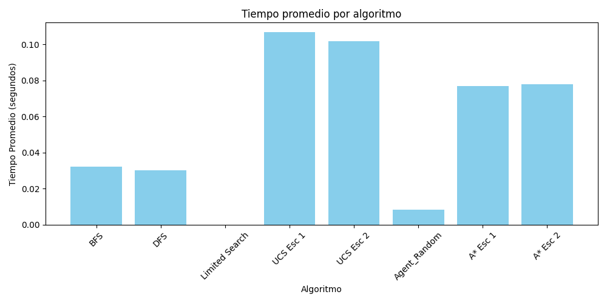
*Figura 1: Comparación del tiempo de ejecución entre los algoritmos.*

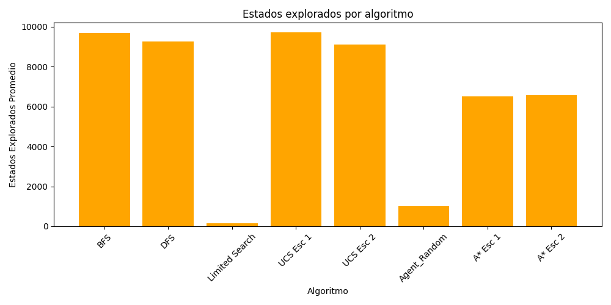
*Figura 2: Comparación del número de estados explorados entre los algoritmos*

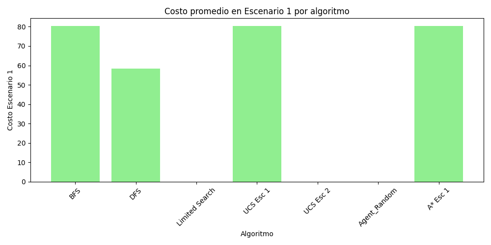
*Figura 3: Comparación del costo en el escenario 1 entre los algoritmos.*

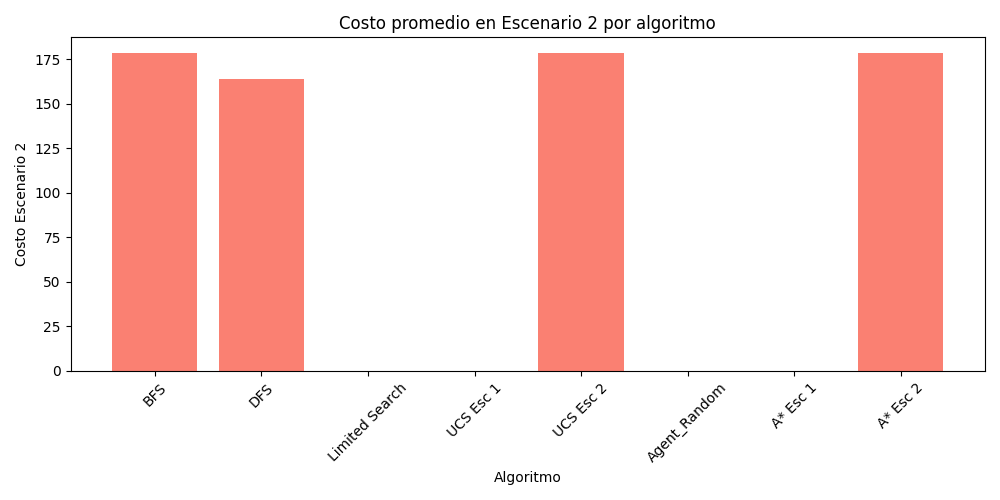
*Figura 4: Comparación del costo en el escenario 2 entre los algoritmos.*

#### Media y desviación estándar por algoritmo

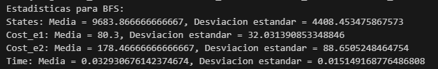
*Figura 5: Media y desviación estándar del algoritmo BFS.*

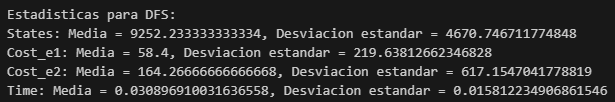
*Figura 6: Media y desviación estándar del algoritmo DFS.*

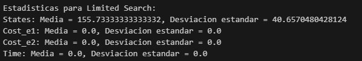
*Figura 7: Media y desviación estándar del algoritmo Limited Search.*

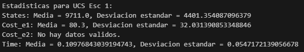
*Figura 8: Media y desviación estándar del algoritmo UCS en el escenario 1.*

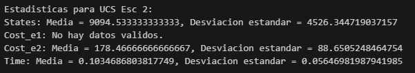
*Figura 9: Media y desviación estándar del algoritmo UCS en el escenario 2.*

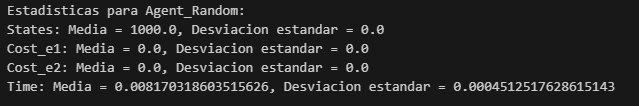
*Figura 10: Media y desviación estándar del agente Random.*

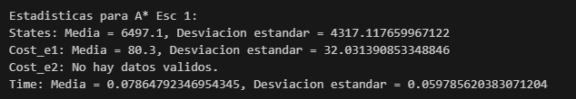
*Figura 11: Media y desviación estándar del algoritmo A estrella en el escenario 2.*

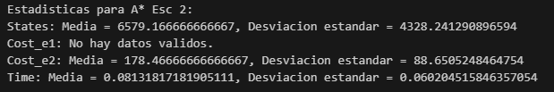
*Figura 12: Media y desviación estándar del algoritmo A estrella en el escenario 2.*

### Análisis de Resultados:

En el gráfico de tiempos de ejecución podemos observar que el "Limited Search" se queda muy atrás de los demás, al no poder alcanzar el objetivo en la mayoría o todas las veces ejecutado. También se puede observar que el agente Random, las veces que puede alcanzar el objetivo, lo hace en poco tiempo, lo cual debe ser debido a que apareció cerca de la meta o tuvo mucha suerte.

En los gráficos de costos se puede observar que los costos para todos los algoritmos, exluyendo el agente Aleatorio y el Limited Search que no llegan al objetivo, son muy parecidos, y que en el escenario 2 hay un aumento considerable en el costo para todos. En el escenario 1 el DFS es superior, aunque en el escenario 2 están todos muy igualados. 

Viendo el gráfico de estados explorados, aquí tenemos también en cuenta los casos en los que no han llegado al objetivo, por lo que podemos observar que el Limited Search explora muy pocos estados hasta llegar a la meta, por lo que los casos en el que sí llega son cuando la meta está cerca del punto de partida. En el caso del algoritmo Random, también sucede que hay mas probabilidades que llegue a la meta si esta está cerca del punto de inicio. Entonces, en este caso, es superior el A estrella en ambos escenarios.

## Conclusiones

Se puede observar que el algoritmo DFS es superior a los demás en cuanto costos y tiempo se refiere, aunque explora más estados que, por ejemplo, el algoritmo A estrella, el cual es superior en ese ámbito. 
Puede considerarse que es mejor usar el algoritmo A estrella, ya que la diferencia en cuanto a tiempo de ejecución y costo no es tan alejado a los demás y explora menos estados, siendo en general el más eficiente.
