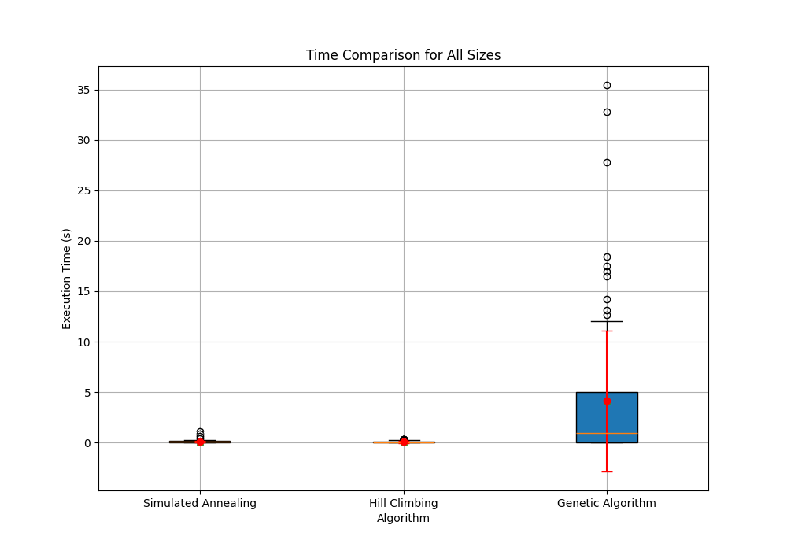
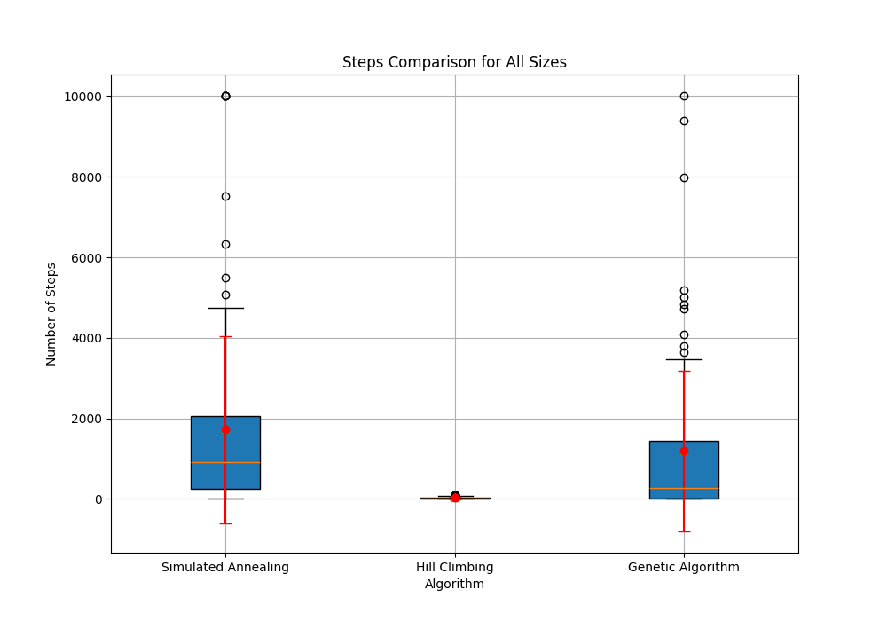
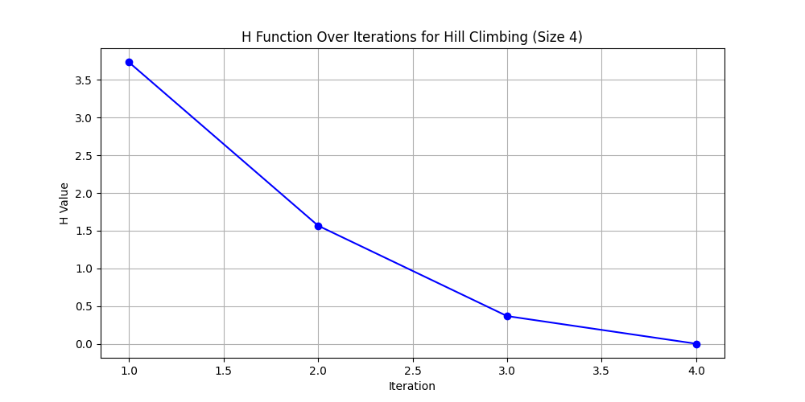
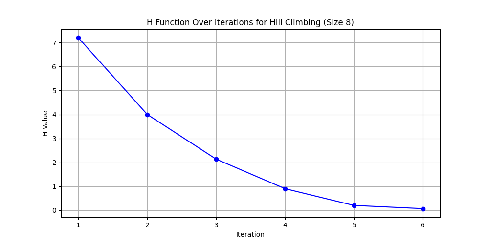
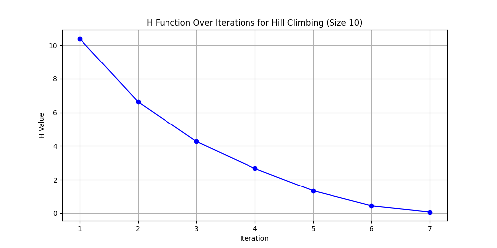
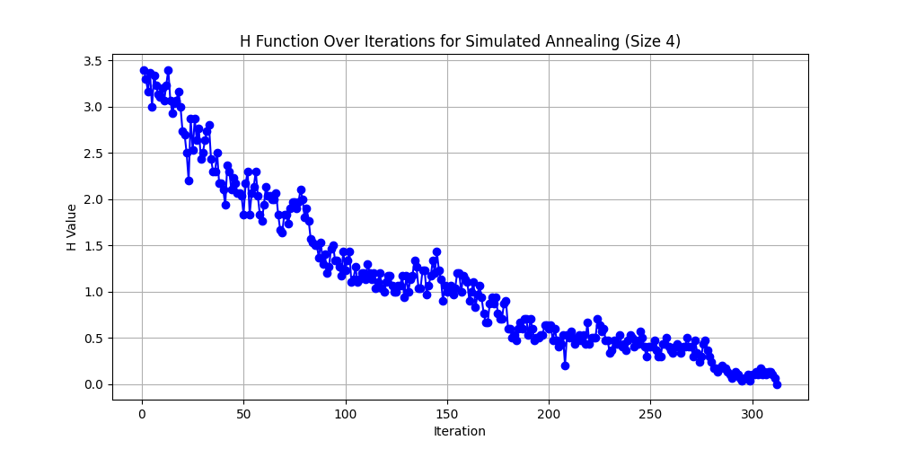
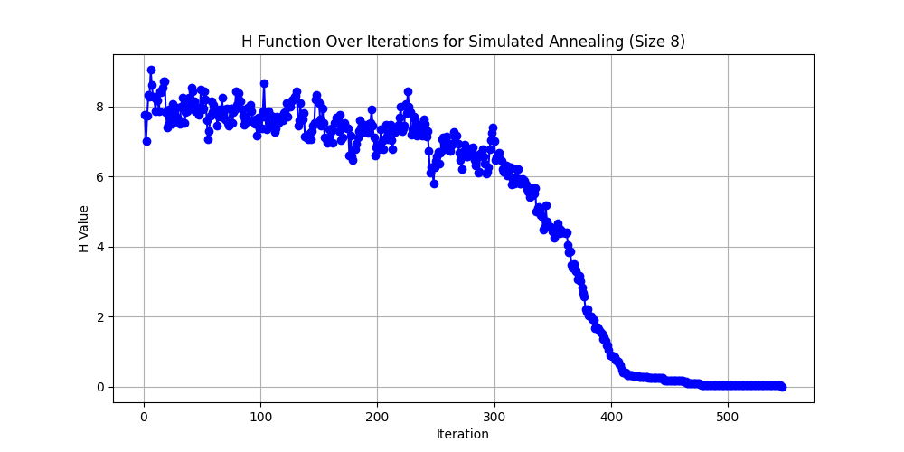
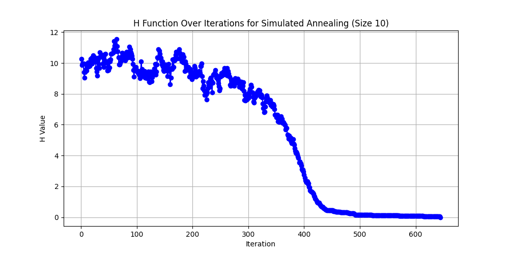
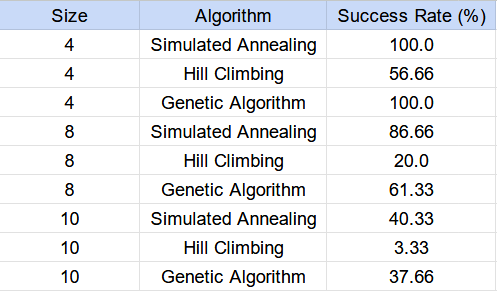

# Algoritmos de Búsqueda Local para Resolver Problema de las N-Reinas

---

## Introducción

En el presente informe se muestra los distintos resultados al utilizar 3 algoritmos distintos para
resolver, en el lenguaje Python, el problema de las N Reinas en un entorno NxN, siendo N los tamaños 4, 8 y 10.

---
## Marco teórico

El problema de las N Reinas consiste en encontrar una distribución de N reinas en un tablero de ajedrez
de N x N de modo tal que éstas no se ataquen. Entonces, no pueden encontrarse dos reinas en la misma fila,
columna o diagonal.

### Hill Climbing

Es un algoritmo de optimización local, iterativo que comienza con una solución arbitraria a un problema, 
luego intenta encontrar una mejor solución variando incrementalmente un único elemento de la solución.
Si el cambio produce una mejor solución, otro cambio incremental se le realiza a la nueva solución,
repitiendo este proceso hasta que no se puedan encontrar mejoras.

### Simulated Annealing

Es un algotimo de optimización global, que busca encontrar una buena aproximación al valor óptimo
de una función en un espacio de búsqueda grande. Se busca minimizar o maximizar una función.

### Genetic Algorithm 

Los algoritmos genético son una técnica de búsqueda local para encontrar soluciones a problemas de 
optimización y aprendizaje, inspirada en los mecanismos de selección natural y evolución de las especies.

---
## Diseño Experimental

En este trabajo se crearon en Python 3 algoritmos de búsqueda local para resolver el problema de las N-Reinas, y estos 
algoritmos eran 'Hill Climbing', 'Simulated Annealing' y 'Genetic Algorithm'. Para cada uno de ellos se crearon
30 tableros de NxN para cada tamaño N, siendo este 4, 8 y 10, y se ejecutaron en ellos. 

Para el algoritmo Simulated Annealing se empieza con una temperatura igual a 100 y se va "enfriando" de acuerdo a un cooling rate igual a 0.99.

Para el Algoritmo Genético se tuvo en cuenta este diseño:
* Individuos: Listas de tuplas que indican la posición (en coordenadas) de las reinas.
* Selección: Selección por ruleta (Cada individuo tiene una probabilidad de ser seleccionado por valor de fitness)
* Reemplazo: Reemplazo generacional (Se reemplaza toda la población con los hijos generados en cada generación)
* Operadores: 
  * Crossover: Se mezclan los genes de los padres para generar 2 hijos.
  * Mutación: Se modifica uno o más genes en un individuo de forma aleatoria (se selecciona una reina al azar y se cambia su fila aleatoriamente).

---

## Análisis y discusión de resultados

### Tiempo de ejecución
Se analizarán los resultados del tiempo de ejecución para todos los tamaños

Se puede observar que el tiempo de ejecución de los dos primeros algoritmos (Hill Climbing y Simulated Annealing) son muy
pequeños y se mantienen en ese lugar, mientras que para el Algoritmo Genético los tiempos son bastante dispersos, y puede
llegar a tener tiempos muy altos de ejecución.

### Estados Visitados

Para los estados visitados, se observan en el siguiente gráfico:

Se puede observar que el Simulated Annealing y el Algoritmo Genético son muy parecidos en este sentido, con muy poca 
diferencia entre ellos, mientras que el algoritmo Hill Climbing recorre la menor cantidad de estados, y con diferencia.

### H Function

Se utilizò las mejores ejecuciones para cada tamaño y por cada algoritmo. Primero se observa el cambio en la función H por cada tamaño para las mejores ejecuciones del algoritmo Hill Climbing:

Ahora se observa el cambio en la función H por cada tamaño para las mejores ejecuciones del algoritmo Simulated Annealing:

### Porcentajes de Éxito

El algoritmo Simulated Algorithm y el Algoritmo Genético tienen un success rate bastante parecido en cada tamaño ejecutado, 
pero se puede observar que el algoritmo Hill CLimbing no es el más óptimo tomando en cuenta esto.

---
## Conclusiones

Se puede concluír que el algoritmo Simulated Annealing es el más eficiente para resolver este problema. Además, el 
algoritmo genético, aunque tenga un success rate parecido, tarda demasiado tiempo en ejecutarse. 
