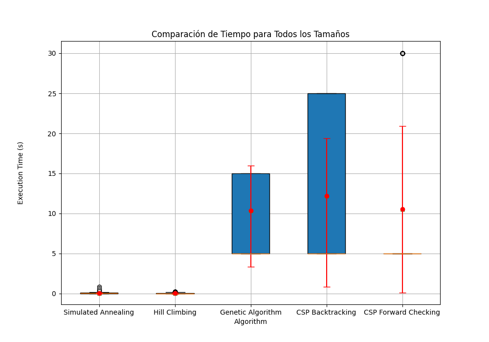
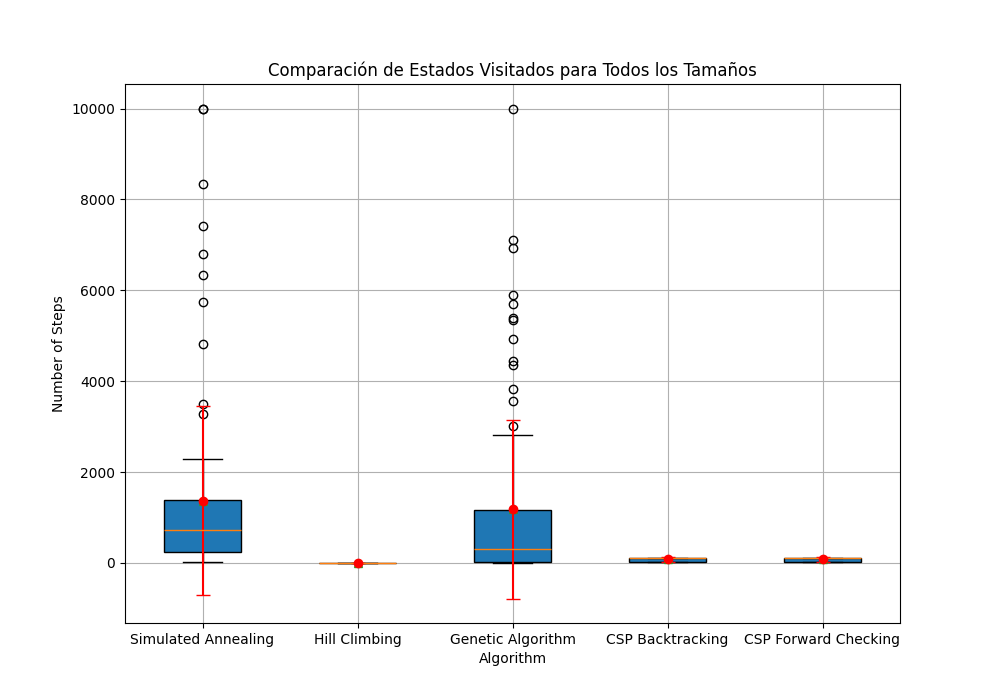
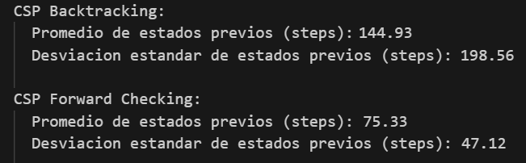

# Trabajo Práctico 6: Satisfacción de restricciones

---

## Ejercicio 1
Una formulación CSP para un Sudoku puede ser de la forma:
- Variables: Cada casillero en el que puede colocarse un número (81 casilleros)
- Dominio: {1, 2, 3, 4, 5, 6, 7, 8, 9}
- Restricciones: Un mismo número no puede estar en la misma fila, misma columna, o misma "caja" de 3x3.

---
## Ejercicio 2
a. Remove SA − WA, delete G from SA.   
b. Remove SA − V , delete R from SA, leaving only B.   
c. Remove NT − WA, delete G from N T .   
d. Remove NT − SA, delete B from N T , leaving only R.   
e. Remove NSW − SA, delete B from N SW .   
f. Remove NSW − V , delete R from N SW , leaving only G.   
g. Remove Q − NT , delete R from Q.   
h. Remove Q − SA, delete B from Q.   
i. Remove Q − NSW , delete G from Q, leaving no domain for Q.

---
## Ejercicio 3
La complejidad en el peor caso cuando se ejecuta AC-3 en un árbol estructurado CSP es de O(E*D), donde E es la cantidad
de edges/aristas y D es el tamaño del dominio más grande.

---
## Ejercicio 4
Para cada valor de Xi, mantenemos un registro de las variables Xk para las que un arco de Xk a Xi se satisface con ese
valor concreto de Xi. Esto puede calcularse en un tiempo proporcional al tamaño de la representación del problema. 
Entonces, cuando se elimina un valor de Xi, reducimos en 1 el conteo de valores permitidos para cada arco (Xk, Xi)
registrado bajo ese valor.

---
## Ejercicio 5
- a)  
Un CSP tiene n-consistencia cuando, para cada subconjunto de variables de tamaño menor o igual a n, cualquier 
asignación a esas variables puede extenderse a una asignación consistente para una variable adicional.
La 2-consistencia implica que cada variable es consistente con las variables conectadas a ella (vecinos). Además, la
estructura de árbol permite que cualquier subconjunto de k variables (con k < n) que sea consistente puede extenderse
a la siguiente variable en el orden del árbol.  
Dado que los árboles no contienen ciclos, no hay conflictos que puedan requerir la reconsideración de las asignaciones
previas. Por lo tanto, la 2-consistencia es suficiente para garantizar la n-consistencia.
- b)  
Ya que cada subconjunto de variables puede extenderse a una asignación consistente para la siguiente variable
en el árbol (por su estructura), y dado que el árbol se puede recorrer sin necesidad de retroceder, la 2-consistencia 
es suficiente para asegurar que se pueden satisfacer todas las restricciones sin necesidad de verificar subconjuntos 
más grandes. 

---
## Ejercicio 7

Se van a comparar los nuevos algoritmos implementados con los del Trabajo Práctico anterior. Para ello, se van a realizar gráficos de cajas y extensiones.

#### Tiempos de ejecución

En este gráfico se ven los tiempos de ejecución de los 2 algoritmos, comparándolos con los demás, teniendo en cuenta todos los tamaños de entorno. Se puede observar que el algoritmo de backtracking utilizando forward checking es más rápido que el de backtracking.

#### Estados explorados

En este gráfico se ven los estados explorados de los 2 algoritmos, comparándolos con los demás, teniendo en cuenta todos los tamaños de entorno. No se puede observar bien cuál explora más o menos estados, por lo que vamos a observar de acuerdo a el promedio y la desviación estandar de cada uno.

Ahora se puede observar que el algoritmo CSP que utiliza forward checking explora menos estados que el de backtracking.

#### Porcentaje de éxito

| Algoritmo            | Porcentaje de Éxito (%) |
|----------------------|-------------------------|
| CSP Backtracking     | 100%                    |
| CSP Forward Checking | 100%                    |

Se puede observar que los dos algoritmos tienen un 100% de éxito, ya que encuentran una solución para todos los casos y en todos los tamaños.

#### Comparar los resultados con aquellos obtenidos en el Trabajo Práctico N° 5.

Los algoritmos CSP han explorado menos estados, aunque el CSP utilizando backtracking ha sido más lento que los demás algoritmos. Los dos CSP al tener 100% porcentaje de éxito, se podría decir que el que conviene utilizar es el CSP utilizando forward checking, ya que es más rápido y explora menos estados. Aunque el CSP con Forward Checking es más lento que, por ejemplo, Simulated Annealing, este último no garantiza una solución en todos los casos (al igual que los demás del trabajo práctico 5). 
Por lo tanto, considero que el mejor algoritmo para resolver el problema de las N-Reinas es el CSP utilizando Forward Checking.