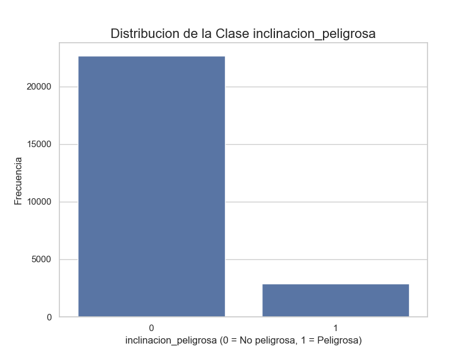
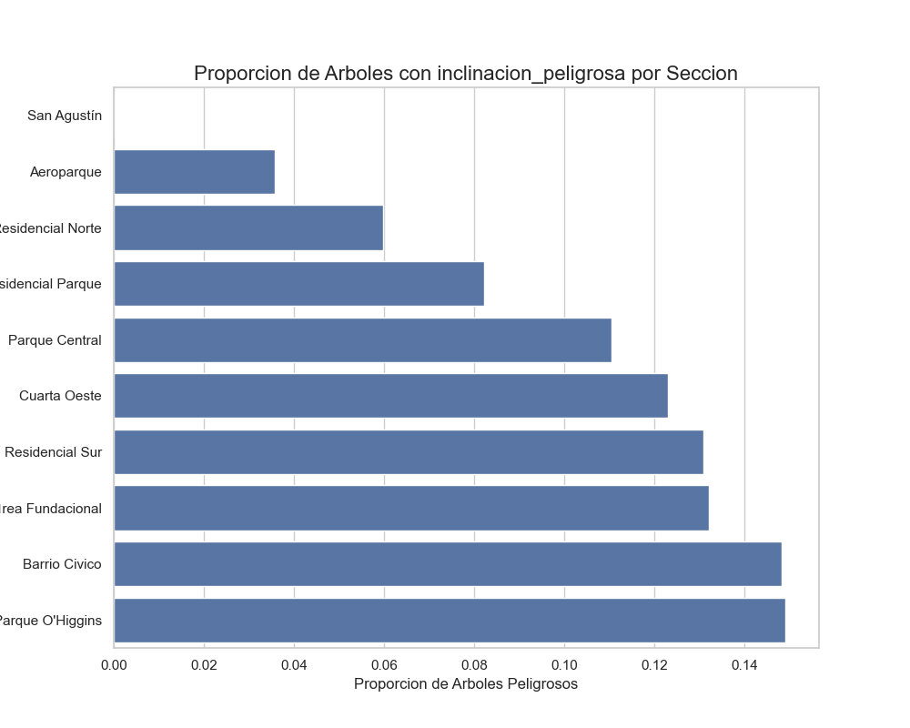
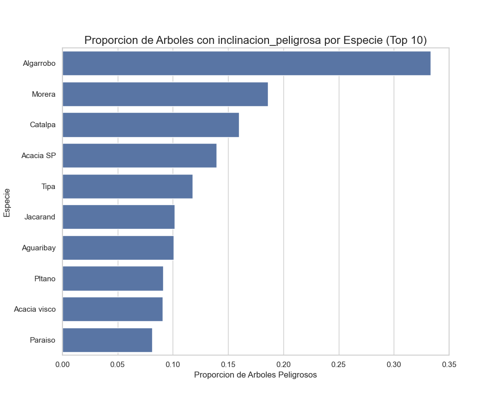
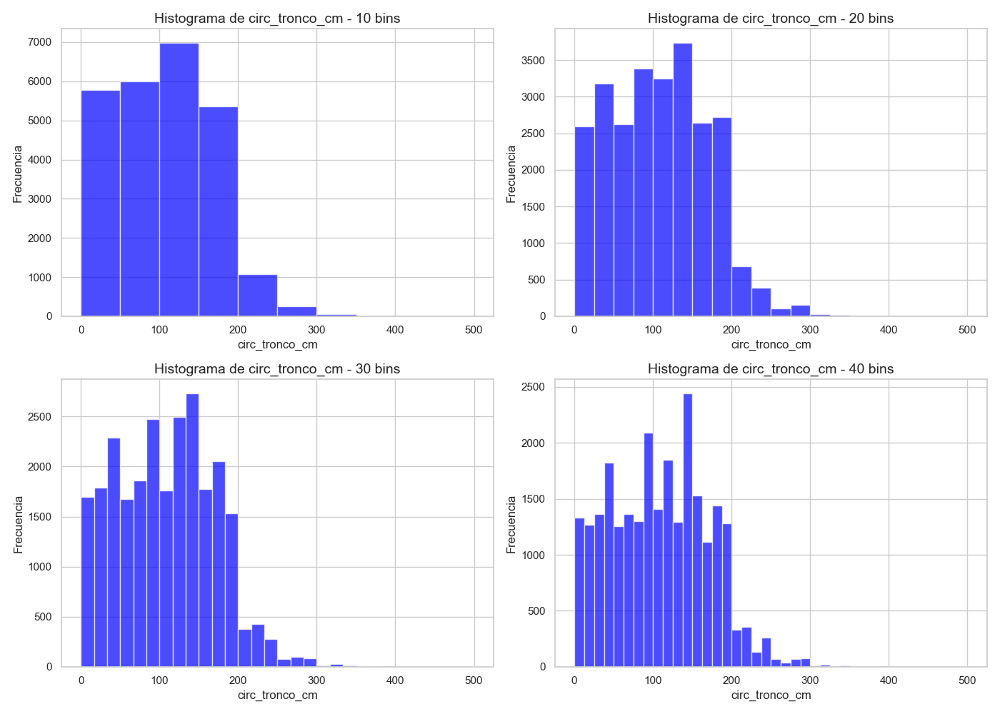
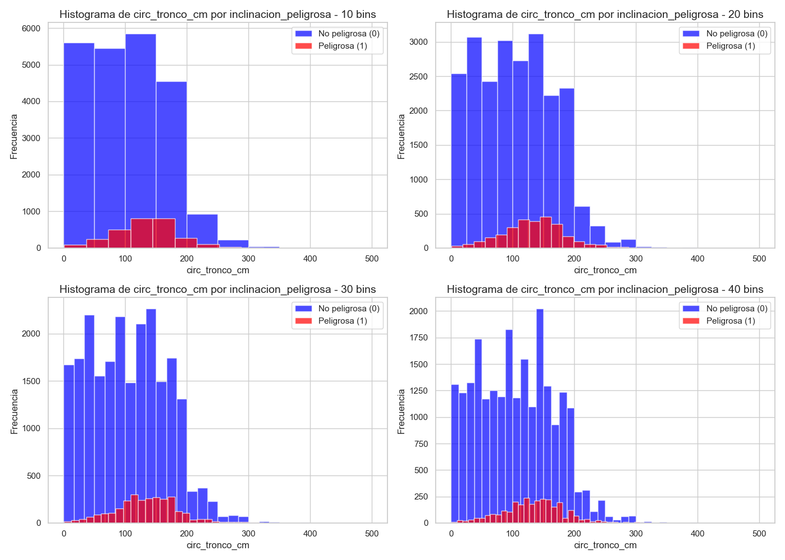

# Respuestas ejercicio 2

### a) ¿Cuál es la distribución de las clase inclinacion_peligrosa?

Se puede observar que está sesgada, es decir, hay más inclinaciones no peligrosas en comparación a las peligrosas.
- No peligrosos: 22663 árboles.
- Peligrosos: 2867 árboles.

### b) ¿Se puede considerar alguna sección más peligrosa que otra?

Se puede considerar que la sección "San Agustín" es la menos peligrosa entre las demás y, además, entre las secciones más
peligrosas se destacan: 
- "Parque O'Higgins": 14.96%
- "Barrio Cívico": 14.60%
- "Cuarta Este Área Fundacional": 13.11%

Siendo "Parque O'Higgins" la sección más peligrosa. 

### c) ¿Se puede considerar alguna especie más peligrosa que otra?

Se puede ver que la especie "Algarrobo" tiende a tener una mayor inclinación y, por lo tanto, ser una especie más 
peligrosa que las demás. Al contrario, la especie "Paraiso" es la que tiene, en general, una menor inclinación, siendo 
la especie más segura.

# Gráficos ejercicio 3

Bins utilizados = [10, 20, 30, 40]

#### Histogramas de circunferencias de tronco por bins 

  

#### Histogramas de circunferencias de tronco por bins por clase

## Criterios de corte ejercicio 3

Se utilizaron cuartiles para el criterio de [bajo, medio, alto, muy alto], siendo estos 0.25 (Q1), 0.50 (Q2 o Mediana)
y 0.75 (Q3). Por lo tanto:

- Bajo: menor o igual al 25%.
- Medio: mayor al 25% y menor o igual al 50%.
- Alto: mayor al 50% y menor o igual al 75%.
- Muy alto: mayor al 75%.